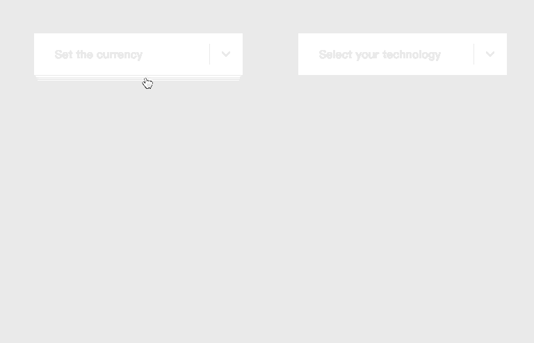

# effect-dropdown-vue

[![NPM version][badge-npm-version]][url-npm]
[![Node version][badge-node-version]][url-npm]
[![NPM download][badge-npm-download]][url-npm]
![Dependencies][badge-dependencies]
![License][badge-license]

[![NPM][image-npm]][url-npm]

Simple effects for Dropdown based on Vue.js。

**中文 | [English](./README_en.md)**

## 安装

```bash
$ npm i -S effect-dropdown-vue # yarn add effect-dropdown-vue
```

## 概览



[访问在线示例](https://xbt1.github.io/effect-dropdown-vue/)

## 使用

一个简单的例子

```javascript
  import EffectDropdown from 'effect-dropdown-vue'
  import 'effect-dropdown-vue/dist/index.css'

  Vue.use(EffectDropdown)
```

```html
<template>
  <div class="dropdown-main">
    <effect-dropdown label="Label" active-color="#97d1bc" effect="camber">
      <effect-dropdown-item>Facebook</effect-dropdown-item>
      <effect-dropdown-item>Twitter</effect-dropdown-item>
      <effect-dropdown-item>Google</effect-dropdown-item>
      <effect-dropdown-item>Airbnb</effect-dropdown-item>
    </effect-dropdown>
  </div>
</template>
```

详细使用方法见 [文档](./docs/usage.md) & [例子](./examples)

## React

[查看 React 版本](https://xbt1.github.io/effect-dropdown-react/)

## 开发

```bash
$ npm install
$ npm run dev
```

## 构建

```bash
$ npm run build:package # 构建 npm 包
$ npm run build:example # 构建示例站点
$ npm run build # build:package & build:example
```

## 更新日志

详见 [releases][url-releases]


[badge-npm-version]: https://img.shields.io/npm/v/effect-dropdown-vue.svg
[badge-node-version]: https://img.shields.io/node/v/effect-dropdown-vue.svg
[badge-npm-download]: https://img.shields.io/npm/dt/effect-dropdown-vue.svg
[badge-license]: https://img.shields.io/github/license/XBT1/effect-dropdown-vue.svg
[badge-dependencies]: https://img.shields.io/david/dev/XBT1/effect-dropdown-vue.svg

[url-npm]: https://npmjs.org/package/effect-dropdown-vue
[url-dependencies]: https://david-dm.org/vkbansal/effect-dropdown-vue
[url-releases]: https://github.com/XBT1/effect-dropdown-vue/releases

[image-npm]: https://nodei.co/npm/effect-dropdown-vue.png
